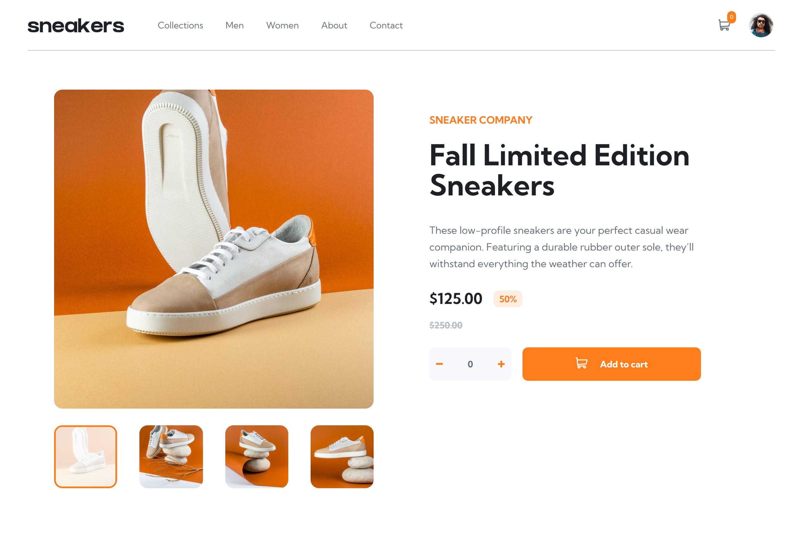

# Frontend Mentor - E-commerce product page solution

This is a solution to the [E-commerce product page challenge on Frontend Mentor](https://www.frontendmentor.io/challenges/ecommerce-product-page-UPsZ9MJp6). Frontend Mentor challenges help you improve your coding skills by building realistic projects.

## Table of contents

- [Overview](#overview)
  - [The challenge](#the-challenge)
  - [Screenshot](#screenshot)
  - [Links](#links)
  - [Built with](#built-with)
  - [What I learned](#what-i-learned)
  - [Continued development](#continued-development)
  - [Useful resources](#useful-resources)
- [Author](#author)
- [Acknowledgments](#acknowledgments)

## Overview

### The challenge

Users should be able to:

- View the optimal layout for the site depending on their device's screen size
- See hover states for all interactive elements on the page
- Open a lightbox gallery by clicking on the large product image
- Switch the large product image by clicking on the small thumbnail images
- Add items to the cart
- View the cart and remove items from it

### Screenshot

### Links

- Solution URL: [https://github.com/Adebesin-Cell/E-Commerce-Product-Page](https://github.com/Adebesin-Cell/E-Commerce-Product-Page)
- Live Site URL: [https://sneakers-e-commerce.netlify.app/](https://sneakers-e-commerce.netlify.app/)

### Built with

- Semantic HTML5 markup
- CSS custom properties
- Flexbox
- CSS Grid
- Desktop First

## What I learned

Learnt how to write thumbnail sliders from scratch and practiced my responsiveness skills.

## Author

- Frontend Mentor - [@Adebesin-Cell](https://www.frontendmentor.io/profile/Adebesin-Cell)
- Twitter - [@Emmanue21243400](https://twitter.com/Emmanue21243400)
